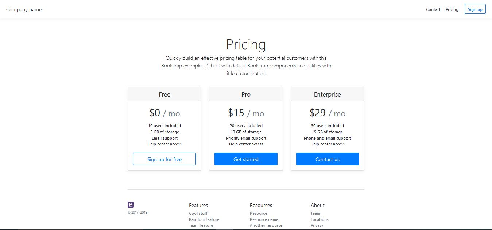
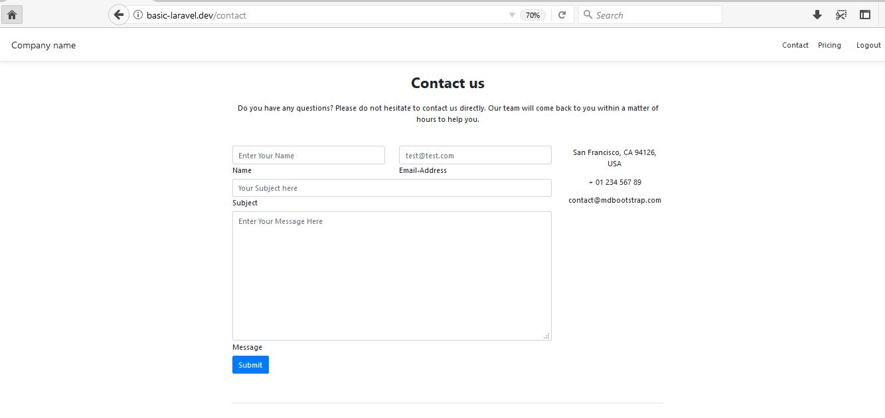
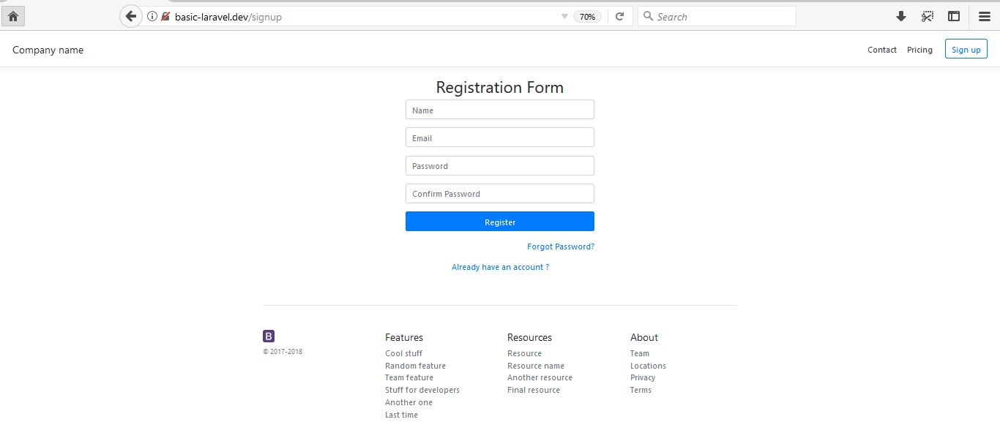
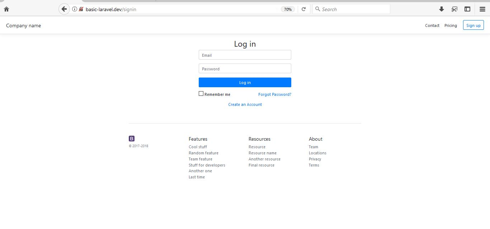
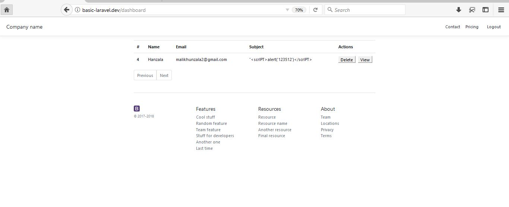

This is my first laravel application to learn laravel for fun just to learn it.

Version : 8.x  

## Installation and Configuration

There are two methods to host laravel application, either use Apache server (Xampp/Wampp) or using [Composer](https://getcomposer.org/) i.e. php dependency maker. I prefer you should use composer(makes work a lot easier) but I used Xampp to host my application.


### 1. Using [Composer](https://getcomposer.org/)

1. Download and install Composer
2. Start your MySql server and create a database named "laravel_basic"
3. Download or clone the repository.
4. Open a environment file named ".env" in your editor and find the following 
 ```
DB_CONNECTION=mysql
DB_HOST=127.0.0.1
DB_PORT=3306
DB_DATABASE=laravel_basic
DB_USERNAME=root
DB_PASSWORD=
 ```
 Change DB_HOST, DB_PORT , DB_USERNAME, DB_PASSWORD according to your sql server settings. 127.0.0.1 refers to localhost and 3306 is default port and save the file.

5. Open Command Prompt (in application directory) and type

```
php artisan migrate
```
6. After migration completed. Type

```
php artisan serve
```
Your application will be hosted on 127.0.0.1:8000 i.e. default IP and PORT.

### 2. Using [Xampp Apache Server](https://www.apachefriends.org/index.html)

1. Download and install xampp or wampp (Xampp in my case).
2. Open file **httpd-vhosts.conf** in xampp installation directory **"C:\xampp\apache\conf\extra"**

 Add following lines at the end
```text

<VirtualHost *:80> 
    DocumentRoot "C:/xampp/htdocs"
    ServerName localhost
</VirtualHost>

<VirtualHost *:80> 
    DocumentRoot "C:/xampp/htdocs/BasicLaravel/public"
    ServerName basic-laravel.dev
</VirtualHost>
```
These are used to create Virtual hosts for our application so we could host our application and visit it using a url **basic-laravel.dev**.

3. Open **hosts** file in **"C:\windows\System32\drivers\etc\"**

 Add following lines and save.

```text
127.0.0.1 localhost
127.0.0.1 basic-laravel.dev
```
 4. Make a directory named **BasicLaravel** in **htdocs** folder of xampp (www in wampp but need to provide wampp directory paths in step 2 and step 3 configurations).

 5. Download or Clone the repository and put all files to **BasicLaravel** folder in htdocs.
 6. Start your MySql server and create a database named **"laravel_basic"**

 7. Open a environment file named ".env" in your editor and find the following 
 ```
DB_CONNECTION=mysql
DB_HOST=127.0.0.1
DB_PORT=3306
DB_DATABASE=laravel_basic
DB_USERNAME=root
DB_PASSWORD=
```
Change DB_HOST, DB_PORT , DB_USERNAME, DB_PASSWORD according to your sql server settings. 127.0.0.1 refers to localhost and 3306 is default port and save the file.

8. Run your apache server and open the url basic-laravel.dev in your browser to visit the application.

=================================================================

## Pages and methods

1. Index Page URL : **basic-laravel.dev/index**

<hr>

2. Contact Page URL : **basic-laravel/contact**


You can Add Details Here for dummy try and save.
<hr>

3. Register Page URL :  **basic-laravel/signup** 


Register here with your details.
<hr>

4. Login Page URL :  **basic-laravel/signin**


Login here with the credentials you used while registering. Upon successful login you will be redirect to **dashboard** page.
<hr>

5. Dashboard Page URL :  **basic-laravel/dashboard**


The contact queries entered through Contact page will be displayed here. Click on View button to see the message and Delete button to delete the query/contact details.
<hr>

#### This is just a dummy application to learn the flow of laravel.
